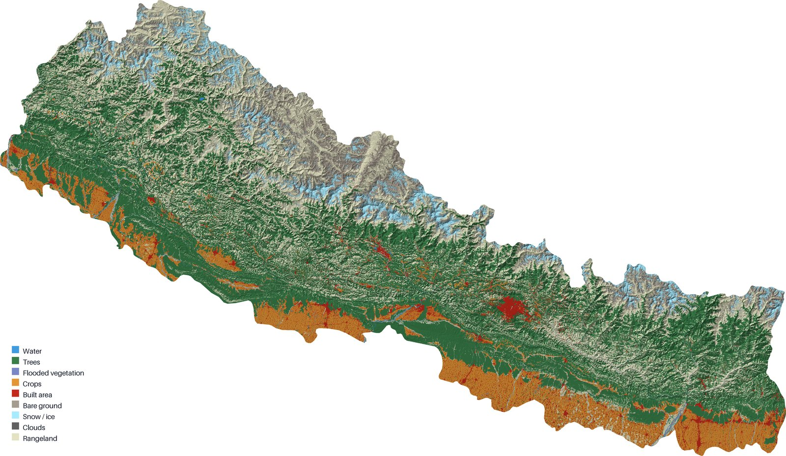

# 3D Land Cover Map

[](https://github.com/DBishal13/3d-export/actions/workflows/generate-map.yml)

A Python-first tool to generate land cover exports and quickly create a 3D-style, hillshaded PNG from Sentinel-2 land cover tiles and Copernicus elevation data — for any country, or a custom area you draw, upload, or type in yourself.

Inspired by the original `rayshader` R workflow.



## Quickstart: Get a 3D PNG

### Option 1: Use the web UI (easiest, no setup)

Open **https://dbishal13.github.io/3d-export/** — pick an area (draw it on the map, a country, a bounding box, pasted GeoJSON, or an uploaded KML/shapefile), optionally enter an email to have the finished map sent to you, and click **Run workflow now**. No GitHub account or token needed; the page tracks the run live and links you to the download when it's done.

### Option 2: Run locally

```powershell
cd d:\3d-land-cover-map
python -m pip install --upgrade pip
python -m pip install -r requirements.txt
python Python/generate_map.py --country BA --output out/land-cover-map.png --mode 3d --aggregate 5
```

Then open `out/land-cover-map-3d.png`.

### Option 3: Trigger GitHub Actions directly

1. Open the workflow dispatch page:
   - https://github.com/DBishal13/3d-export/actions/workflows/generate-map.yml
2. Click **Run workflow**.
3. Enter a `country_code` (or an `aoi_geojson` to override it with a custom area), choose `output_format` and `mode`, and set an `aggregate` value.
4. Run the workflow.
5. After the job completes, open the workflow run and download the generated artifact from the summary panel.

## What is included

- `Python/generate_map.py` / `Python/map_utils.py` — the export tool: resolves an area of interest (country or custom AOI), streams matching Sentinel-2 land cover tiles and Copernicus DEM elevation tiles directly from their remote sources (no bulk local download), and renders a hillshade-blended, legended PNG. Scales to any country size, including antimeridian-crossing ones like Russia.
- `.github/workflows/generate-map.yml` — GitHub Actions workflow that runs the export tool on demand, with an optional step to email the result via Gmail.
- `docs/index.html` / `docs/styles.css` — the GitHub Pages UI: a full-viewport MapLibre map for drawing or previewing an AOI, and a floating panel to configure and trigger a run, track it live, and get to the download.
- `cloudflare-worker/` — a small Cloudflare Worker that holds a repo-scoped GitHub token server-side and proxies just the `workflow_dispatch` call, so visitors to the web UI never need a GitHub token of their own (rate-limited to guard the repo's own Actions quota).
- `requirements.txt` — Python dependencies for GIS raster processing.

## Local usage

1. Install dependencies:

```powershell
cd d:\3d-land-cover-map
python -m pip install --upgrade pip
python -m pip install -r requirements.txt
```

2. Run the generator:

```powershell
python Python/generate_map.py --country BA --output out/land-cover-map.png --mode 3d --aggregate 5
```

Or with a custom area instead of a country:

```powershell
python Python/generate_map.py --aoi-geojson '{"type":"Polygon","coordinates":[[...]]}' --output out/land-cover-map.png --mode 3d
```

3. Find the generated file in `out/` (3D-mode exports get a `-3d` suffix).

## GitHub Actions export

A workflow is available at `.github/workflows/generate-map.yml` and can be triggered manually from the repository Actions tab, or via the web UI.

Input values:
- `country_code` — country name or ISO code (ignored if `aoi_geojson` is set)
- `aoi_geojson` — a custom area of interest as a GeoJSON Geometry/Feature/FeatureCollection, overriding `country_code`
- `output_format` — `png` or `jpg`
- `mode` — `3d` (hillshaded relief) or `2d` (flat)
- `aggregate` — downsample factor for output size
- `email` — optional; if set (and the repo owner has configured Gmail secrets, see below), the finished file is emailed as an attachment

The workflow uploads the generated image as an artifact regardless.

## GitHub Pages UI

The static UI lives in `docs/index.html`, published via GitHub Pages from the `docs/` folder. It lets visitors:
- Pick an area of interest by drawing a polygon/rectangle directly on the map, typing a country or bounding box, pasting GeoJSON, or uploading a KML/shapefile (converted to GeoJSON in the browser).
- Trigger the workflow with no GitHub account or token — the request goes through the Cloudflare Worker proxy in `cloudflare-worker/`.
- Watch the run's status live and get a link straight to the finished artifact.

## Repo owner setup (one-time)

Two optional features need the repo owner to configure secrets — everything else works without them:

- **No-token dispatch (Cloudflare Worker)**: deploy `cloudflare-worker/dispatch-proxy.js` to Cloudflare Workers, bind a KV namespace as `RATE_LIMIT_KV`, and set a `GITHUB_TOKEN` secret (a fine-grained PAT scoped to this repo with Actions: Read and write). Point `DISPATCH_PROXY_URL` in `docs/index.html` at the deployed Worker's URL.
- **Email delivery (Gmail)**: add repo secrets `MAIL_USERNAME` (a Gmail address) and `MAIL_PASSWORD` (a Gmail App Password, requires 2FA) under Settings → Secrets and variables → Actions.

## Shoutout

Inspired by the original R `rayshader` land cover map workflow, this repo now provides a Python-first export tool for 3D-style PNG generation.
